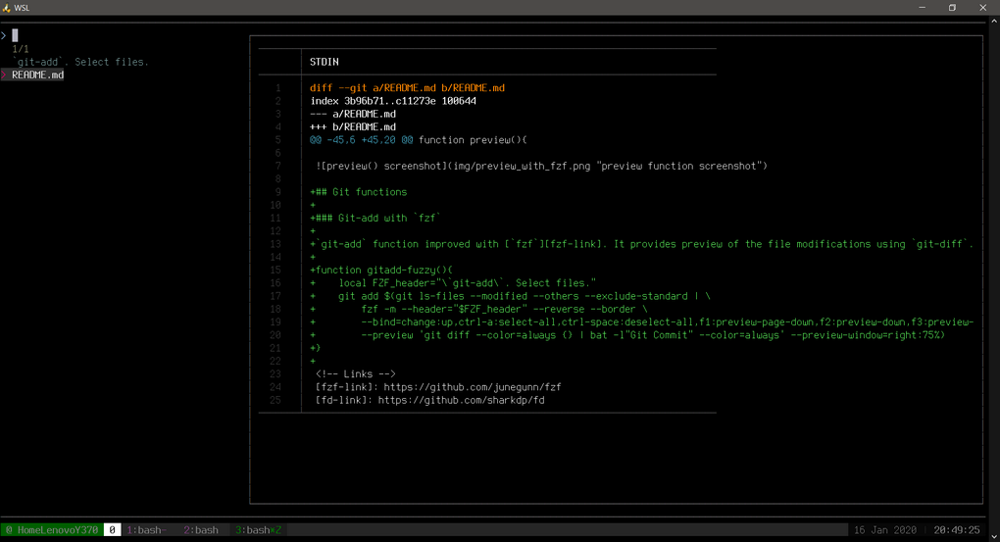
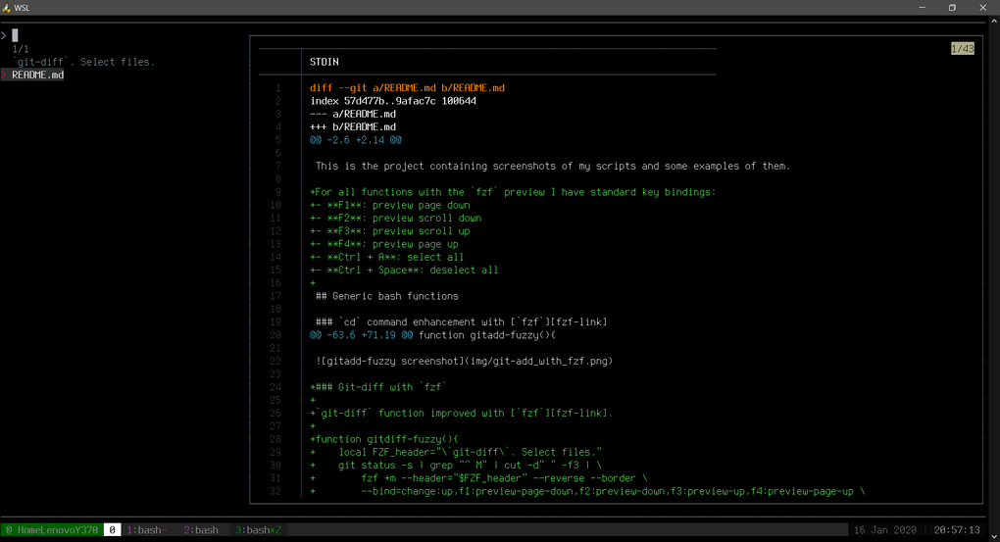
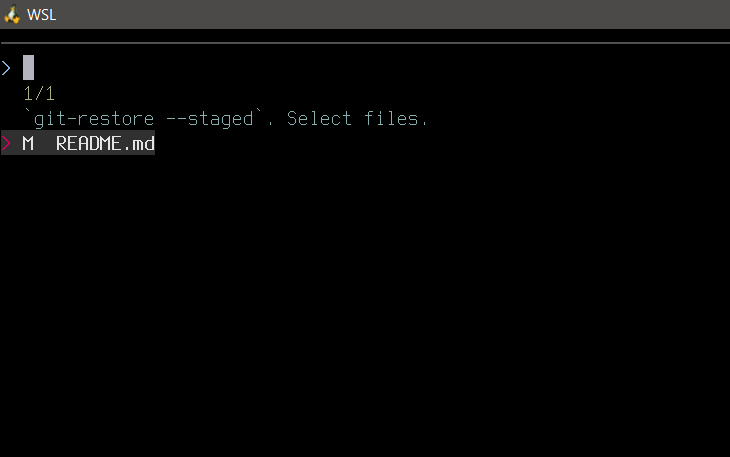
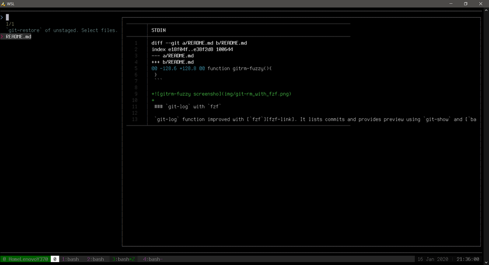
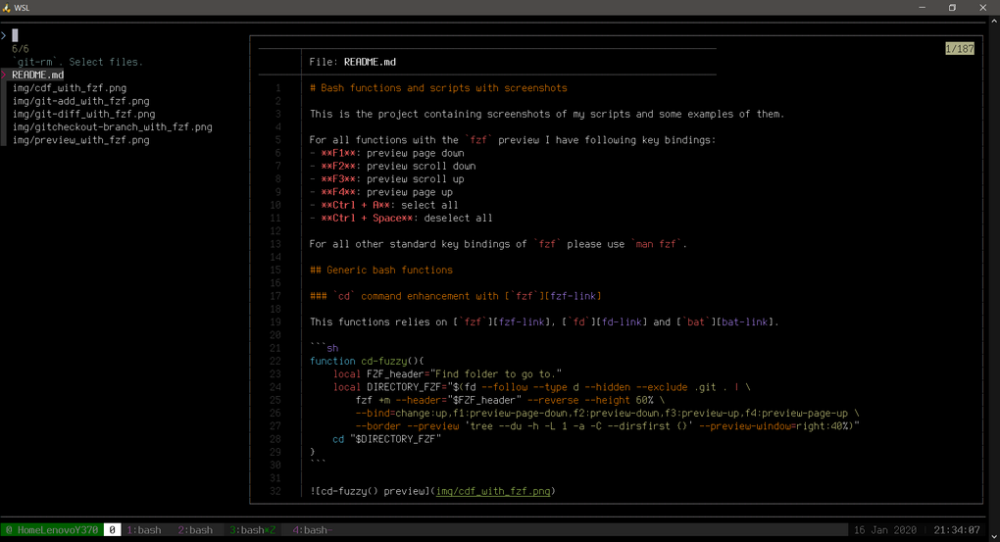
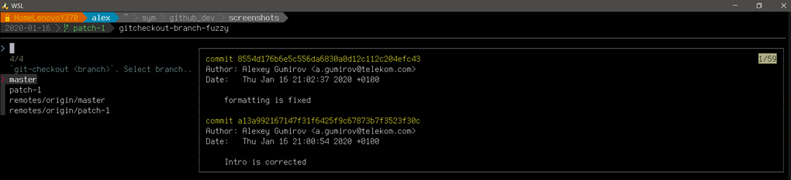

# Bash functions and scripts with screenshots

This is the project containing screenshots of my scripts and some examples of them.

For all functions with the `fzf` preview I have following key bindings:
- **F1**: preview page down
- **F2**: preview scroll down
- **F3**: preview scroll up
- **F4**: preview page up
- **Ctrl + A**: select all
- **Ctrl + Space**: deselect all

For all other standard key bindings of `fzf` please use `man fzf`.

## Generic bash functions

### `cd` command enhancement with [`fzf`][fzf-link]

This functions relies on [`fzf`][fzf-link], [`fd`][fd-link] and [`bat`][bat-link].

```sh
function cd-fuzzy(){
    local FZF_header="Find folder to go to."
    local DIRECTORY_FZF="$(fd --follow --type d --hidden --exclude .git . | \
        fzf +m --header="$FZF_header" --reverse --height 60% \
        --bind=change:up,f1:preview-page-down,f2:preview-down,f3:preview-up,f4:preview-page-up \
        --border --preview 'tree --du -h -L 1 -a -C --dirsfirst {}' --preview-window=right:40%)"
    cd "$DIRECTORY_FZF"
}
```


### Preview of files in terminal (non-binary)

This functions relies on [`fzf`][fzf-link], [`fd`][fd-link] and [`bat`][bat-link].

```sh
function preview(){
    if [[ ! -z $1 ]];then
        local FZF_header="Preview of \`$1\` files."
        fd --type f -e $1 --hidden --follow --exclude .git . | \
            fzf +m --header="$FZF_header" --reverse \
            --bind=change:up,f1:preview-page-down,f2:preview-down,f3:preview-up,f4:preview-page-up \
            --preview 'bat --style=numbers --color=always {}' --preview-window=right:75%:wrap
    else
        local FZF_header="\`preview <ext>\` shows files of defined extension."
        fd --type f --hidden --follow --exclude .git . | \
            fzf +m --header="$FZF_header" --reverse \
            --bind=change:up,f1:preview-page-down,f2:preview-down,f3:preview-up,f4:preview-page-up \
            --preview 'bat --style=numbers --color=always {}' --preview-window=right:75%:wrap
    fi
}
```


## Git functions

### `git-add` with `fzf`

`git-add` function improved with [`fzf`][fzf-link]. It provides preview of the file modifications using `git-diff`.

```sh
function gitadd-fuzzy(){
    local FZF_header="\`git-add\`. Select files."
    git add $(git ls-files --modified --others --exclude-standard | \
        fzf -m --header="$FZF_header" --reverse --border \
        --bind=change:up,ctrl-a:select-all,ctrl-space:deselect-all,f1:preview-page-down,f2:preview-down,f3:preview-up,f4:preview-page-up \
        --preview 'git diff --color=always {} | bat -l"Git Commit" --color=always' --preview-window=right:75%)
}
```



### `git-diff` with `fzf`

`git-diff` function improved with [`fzf`][fzf-link].

```sh
function gitdiff-fuzzy(){
    local FZF_header="\`git-diff\`. Select files."
    git status -s | grep "^ M" | cut -d" " -f3 | \
        fzf +m --header="$FZF_header" --reverse --border \
        --bind=change:up,f1:preview-page-down,f2:preview-down,f3:preview-up,f4:preview-page-up \
        --preview 'git diff --color=always {} | bat -l"Git Commit" --color=always' --preview-window=right:75%:wrap
}
```



### `git-restore --staged` with `fzf` 

`git-restore` function improved with [`fzf`][fzf-link]. It lists staged files which you want to restore in a nice way.

```sh
function gitrestore-staged-fuzzy(){
    local FZF_header="\`git-restore --staged\`. Select files."
    git restore --staged $(git status -s | grep "^D\|^M" | fzf -m --header="$FZF_header" --reverse \
        --border --bind=change:up,ctrl-a:select-all,ctrl-space:deselect-all | cut -d" " -f3)
}
```



### `git-restore` with `fzf` for unstaged

`git-restore` function improved with [`fzf`][fzf-link] for the unstaged files. It lists unstaged files which you want to restore in a nice way and provides preview using `git-diff`.

```sh
function gitrestore-unstaged-fuzzy(){
    local FZF_header="\`git-restore\` of unstaged. Select files."
    git restore $(git status -s | grep "^ D\|^ M" | cut -d" " -f3 | \
        fzf -m --header="$FZF_header" --reverse --border \
        --bind=change:up,ctrl-a:select-all,ctrl-space:deselect-all,f1:preview-page-down,f2:preview-down,f3:preview-up,f4:preview-page-up \
        --preview 'git diff --color=always {} | bat -l"Diff" --color=always' --preview-window=right:75%)
}
```



### `git-rm` with `fzf`

`git-rm` function improved with [`fzf`][fzf-link]. It lists files which you want to remove in a nice way and provides preview using [`bat`][bat-link].

```sh
function gitrm-fuzzy(){
    local FZF_header="\`git-rm\`. Select files."
    git rm $(git ls-files | fzf -m --header="$FZF_header" --reverse --border \
        --bind=change:up,ctrl-a:select-all,ctrl-space:deselect-all,f1:preview-page-down,f2:preview-down,f3:preview-up,f4:preview-page-up \
        --preview 'bat --color=always {}' --preview-window=right:75%)
}
```



### `git-log` with `fzf`

`git-log` function improved with [`fzf`][fzf-link]. It lists commits and provides preview using `git-show` and [`bat`][bat-link].

```sh
function gitlog-fuzzy(){
    local FZF_header="\`git-log\`. Select commit."
    git log --pretty=oneline | cut -c-20 | fzf -m --header="$FZF_header" --reverse --border \
        --bind=change:up,f1:preview-page-down,f2:preview-down,f3:preview-up,f4:preview-page-up \
        --preview 'git show --color=always {} | bat -l"Git Commit" --color=always' --preview-window=right:75%
}
```

### `git-merge` with `fzf`

`git-merge` function improved with [`fzf`][fzf-link]. It lists branches and provides preview using `git-log`.

```sh
function gitmerge-fuzzy(){
    local FZF_header="\`git-merge\`. Select branch to merge."
    local branch=`git branch -a | sed 's/^\*//; s/^[ \t]*//; /HEAD.*/d; /^remotes\/origin\/$/d' | \
        fzf +m --header="$FZF_header" --height 40% --border --reverse \
        --bind=change:up,f1:preview-page-down,f2:preview-down,f3:preview-up,f4:preview-page-up \
        --preview 'git log --color=always {} -10'  --preview-window=right:75% | sed 's/remotes\/origin\///'`
    if [[ ! -z $branch ]]; then
        git merge $branch
    fi
}
```

### `git-checkout <branch>` with `fzf`

`git-checkout <branch>` function improved with [`fzf`][fzf-link]. It lists branches and provides preview using `git-log`.

```sh
function gitcheckout-branch-fuzzy(){
    local FZF_header="\`git-checkout <branch>\`. Select branch to checkout."
    local branch=`git branch -a | sed 's/^\*//; s/^[ \t]*//; /HEAD.*/d; /^remotes\/origin\/$/d' | \
        fzf +m --header="$FZF_header" --height 40% --border --reverse \
        --bind=change:up,f1:preview-page-down,f2:preview-down,f3:preview-up,f4:preview-page-up \
        --preview 'git log --color=always {} -10'  --preview-window=right:75% | sed 's/remotes\/origin\///'`
    if [[ $branch ]]; then
        git checkout $branch
    fi
}
```



<!-- Links -->
[fzf-link]: https://github.com/junegunn/fzf
[fd-link]: https://github.com/sharkdp/fd 
[bat-link]: https://github.com/sharkdp/bat
