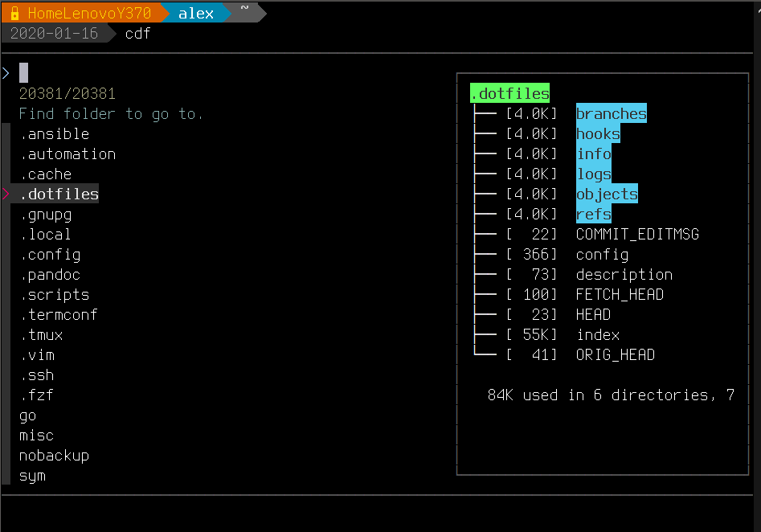
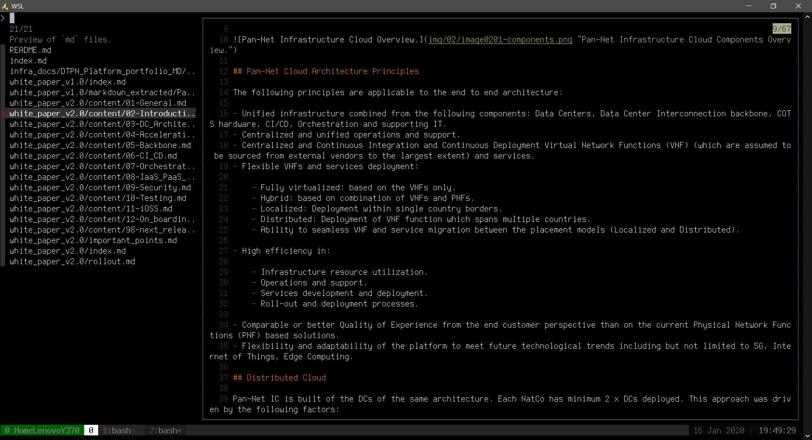

# Screenshots

This is the project containing screenshots of my scripts and some examples of them.

## Generic bash functions

### `cd` command enhancement with `fzf`

This functions relies on `fzf`, `fd` and `bat`.

```sh
function cd-fuzzy(){
    local FZF_header="Find folder to go to."
    local DIRECTORY_FZF="$(fd --follow --type d --hidden --exclude .git . | fzf +m --header="$FZF_header" --reverse --height 60% --bind=change:up,f1:preview-page-down,f2:preview-down,f3:preview-up,f4:preview-page-up --border --preview 'tree --du -h -L 1 -a -C --dirsfirst {}' --preview-window=right:40%)"
    cd "$DIRECTORY_FZF"
}
```



### Preview of files in terminal (non-binary)

This functions relies on `fzf`, `fd` and `bat`.

```sh
function preview(){
    if [[ ! -z $1 ]];then
        local FZF_header="Preview of \`$1\` files."
        fd --type f -e $1 --hidden --follow --exclude .git . | fzf +m --header="$FZF_header" --reverse --bind=change:up,f1:preview-page-down,f2:preview-down,f3:preview-up,f4:preview-page-up --preview 'bat --style=numbers --color=always {}' --preview-window=right:75%:wrap
    else
        local FZF_header="\`preview <ext>\` shows files of defined extension."
        fd --type f --hidden --follow --exclude .git . | fzf +m --header="$FZF_header" --reverse --bind=change:up,f1:preview-page-down,f2:preview-down,f3:preview-up,f4:preview-page-up --preview 'bat --style=numbers --color=always {}' --preview-window=right:75%:wrap
    fi
}
```




